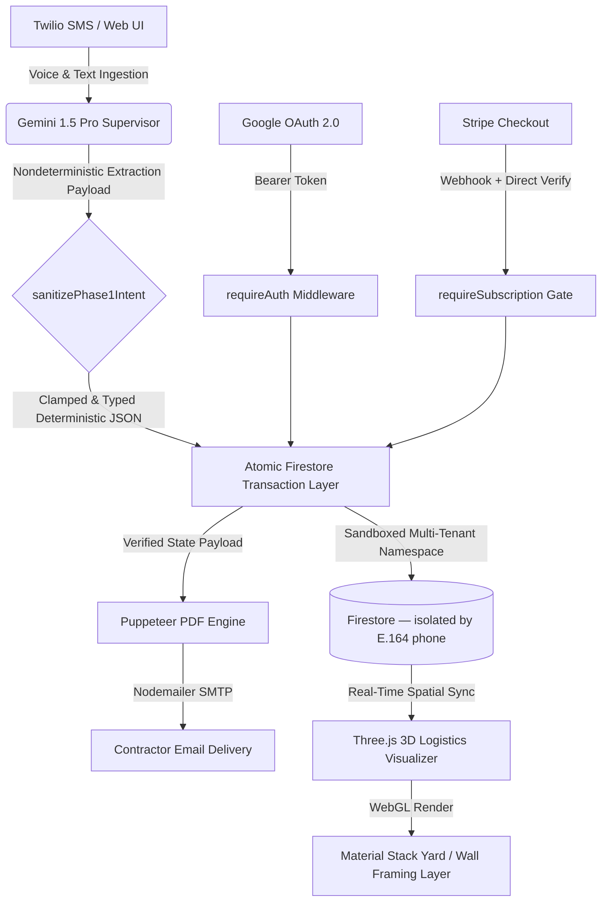

# StudCast (Lone Ranger Estimator)
### Cloud-Native, Multi-Tenant AI Systems Architecture & 3D Logistics Engine

StudCast is an enterprise-grade vertical SaaS infrastructure built for solo residential contractors. The platform orchestrates nondeterministic Large Language Models (LLMs) with strict, real-world building physics and deterministic business rules, serving a real-time 3D logistics spatial engine and automated cloud pipelines.

Live production: `https://lone-ranger-app-879716207624.us-central1.run.app`

---

## Architectural Topology



---

## Core Tech Stack

| Layer | Technology |
|-------|-----------|
| Runtime | Node.js 20 / Express |
| Deployment | Google Cloud Run (auto-scaled, containerized) |
| Database | Cloud Firestore (multi-tenant, serverless) |
| AI Model | Gemini 1.5 Pro (`@google/genai`) |
| Frontend | React 18 + Vite + TypeScript + Tailwind CSS v4 |
| 3D Engine | Three.js (WebGL) — OrbitControls, raycasting, procedural geometry |
| Auth | Google OAuth 2.0 ID Tokens |
| Payments | Stripe Checkout + Webhooks |
| SMS | Twilio (10DLC registered) + Nodemailer email OTP fallback |
| PDF | Puppeteer (headless Chrome) |
| Secrets | Google Secret Manager |
| Build | Google Cloud Build (`cloudbuild.yaml`) |

---

## Key Systems

### 1. LLM → Deterministic Pipeline

Voice or text input is processed by Gemini 1.5 Pro, which extracts a raw material takeoff. The output is inherently nondeterministic — so it passes through `sanitizePhase1Intent()`, a typed clamping layer that enforces real-world building physics before any data is persisted:

- Wall length clamped to `4–30 ft`
- Wall height clamped to `8–12 ft`
- Stud spacing constrained to `16"` or `24"` on-center only
- Door and window counts validated against wall length
- All numeric fields typed and range-validated

The resulting deterministic JSON is written atomically to Firestore and immediately consumed by the Three.js visualizer.

### 2. Multi-Tenant Isolation

Every contractor is a fully isolated Firestore namespace keyed by E.164 phone number. Auth resolves `Google email → phone → data path`. No cross-tenant query is structurally possible — all Firestore reads and writes scope to `users/{phone}/...`.

```
users/{phone}/
  estimates/{estimateId}     ← line items, totals, client info
  settings/config            ← profile, markup %, tax rate, subscription state
  price_book/{itemId}        ← self-learning material price cache
```

### 3. Self-Teaching Price Book

Each successful PDF generation feeds approved material prices back into a per-tenant `price_book` collection. Subsequent extractions for the same contractor pre-populate unit prices from their own historical jobs rather than model defaults.

### 4. Three.js 3D Spatial Engine

The visualizer operates in two modes:

**Stack Layer (Material Yard)**
- SPF studs, PT sole plates, and OSB sheathing rendered as true-scale lift geometry (294 pcs/lift, 86 sheets/bunk)
- Dunnage blocks, plastic wrap texture, and lumber grain procedurally generated via Canvas API
- Fleet dispatch calculated from cargo weight: one flatbed per 11,200 lbs
- Raycasting tooltips on hover — material type, quantity, estimated weight

**Build Layer (Wall Framing)**
- Physically correct framing: king studs, jack studs, double top plates, treated sole plate, headers, cripple studs, window sills
- Door and window rough openings deducted from stud layout
- Drywall overlay with adjustable opacity (0–100%) for X-ray view

### 5. Subscription & Billing Architecture

Stripe integration is webhook-independent for reliability. On payment return:

1. `POST /api/billing/verify-session` retrieves the Stripe Checkout session directly via API
2. Confirms `payment_status === 'paid'` and `client_reference_id === userPhone`
3. Atomically writes `active_subscription: true` to Firestore

Webhooks remain active as a secondary sync path. `requireSubscription` middleware gates all AI processing and PDF generation endpoints.

### 6. OTP Registration with Fallback Transport

Registration deploys a 6-digit OTP across a priority cascade:

```
Twilio SMS  →  (if 10DLC pending)  →  Gmail SMTP  →  (if both fail)  →  console.warn
```

Returns `{ channel: 'sms' | 'email' | 'log' }` so the frontend renders the correct verification prompt.

---

## API Surface

| Method | Route | Auth | Description |
|--------|-------|------|-------------|
| POST | `/api/auth/register` | Public | Phone registration + OTP dispatch |
| POST | `/api/auth/verify` | Public | OTP verification |
| GET | `/api/estimates` | Bearer | List all estimates (summary) |
| GET | `/api/estimates/:id` | Bearer | Full estimate with line items |
| POST | `/api/estimates/:id/save` | Bearer | Save / update estimate |
| DELETE | `/api/estimates/:id` | Bearer | Delete estimate |
| POST | `/api/process-text` | Bearer + Sub | Text → Gemini material extraction |
| POST | `/api/process` | Bearer + Sub | Audio upload → Gemini extraction |
| POST | `/api/generate-pdf` | Bearer + Sub | Puppeteer PDF → email delivery |
| GET | `/api/settings` | Bearer | Load contractor profile |
| POST | `/api/settings` | Bearer | Save contractor profile |
| POST | `/api/billing/create-checkout` | Bearer | Stripe session creation |
| POST | `/api/billing/verify-session` | Bearer | Direct payment verification |
| POST | `/api/webhooks/stripe` | Stripe sig | Subscription lifecycle events |
| POST | `/api/webhook` | Twilio sig | Inbound SMS bridge |

---

## React Dashboard (New)

The dashboard UI was rebuilt from scratch as a React 18 + TypeScript + Vite application:

- **Cosmic glass aesthetic** — procedural canvas starfield with parallax inertia, glassmorphism panels, aurora gradient pools
- **Workflow stage system** — CAPTURE → PROCESS → VISUALIZE → FINALIZE, driven by AI and interaction state
- **Full-bleed Three.js canvas** — the 3D scene is the environment, not a panel
- **Voice orb** — center-anchored interaction point with pulsing ring animations, waveform visualizer, and real-time status
- **Collapsible ledger drawer** — bottom sheet with inline-editable material and labor tables
- **Floating instrument panels** — framing controls, price sheet, change order engine, visualizer settings

**Component architecture:**

```
ui/src/
├── App.tsx                  ← orchestrator, auth, API wiring
├── types.ts
└── components/
    ├── ThreeVisualizer.tsx   ← WebGL scene, both modes
    ├── SettingsModal.tsx
    ├── EstimateList.tsx
    └── LedgerTable.tsx
```

The legacy onboarding flow (Google OAuth → Phone OTP → Stripe) runs on the existing vanilla HTML stack and hands off to the React dashboard after authentication — zero-regression migration with no user-facing disruption.

---

## Deployment

Cloud Run is configured for production via `cloudbuild.yaml`. The Dockerfile installs Chromium, builds the React app, and prunes dev dependencies in a single layer:

```dockerfile
RUN cd ui && npm ci && npm run build && rm -rf node_modules
```

Environment secrets (Gemini API key, Stripe keys, Twilio credentials, Gmail App Password) are injected at runtime via Google Secret Manager — none stored in source.

```bash
# Deploy
gcloud builds submit
gcloud run deploy lone-ranger-app --region us-central1 --platform managed
```

---

## Production Status

| Feature | Status |
|---------|--------|
| Cloud Run deployment | ✅ Live |
| Multi-tenant Firestore | ✅ Live |
| Google OAuth auth | ✅ Live |
| Gemini AI extraction | ✅ Live |
| Stripe subscriptions | ✅ Live |
| Puppeteer PDF + email | ✅ Live |
| Twilio SMS (10DLC) | 🔄 Campaign review pending |
| Email OTP fallback | ✅ Live |
| React dashboard | ✅ Live (migrating from legacy) |
| Three.js visualizer | ✅ Live — Stack + Build modes |
