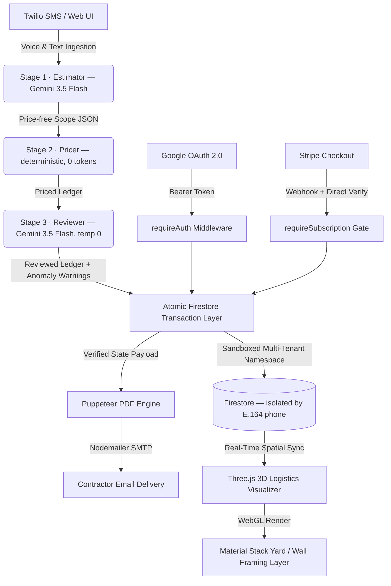

# Lone Ranger Estimator
### Cloud-Native, Multi-Tenant AI Systems Architecture & 3D Logistics Engine

Lone Ranger Estimator is an enterprise-grade vertical SaaS infrastructure built for solo residential contractors. The platform orchestrates nondeterministic Large Language Models (LLMs) with strict, real-world building physics and deterministic business rules, serving a real-time 3D logistics spatial engine and automated cloud pipelines.

Live production: `https://lone-ranger-app-879716207624.us-central1.run.app`

---

## Architectural Topology



---

## Core Tech Stack

| Layer | Technology |
|-------|-----------|
| Runtime | Node.js 20 / Express |
| Deployment | Google Cloud Run (auto-scaled, containerized) |
| Database | Cloud Firestore (multi-tenant, serverless) |
| AI Model | Gemini 3.5 Flash (`@google/genai`) — deterministic 3-stage pipeline |
| Frontend | React 19 + Vite + TypeScript + Tailwind CSS v4 |
| 3D Engine | Three.js (WebGL) — OrbitControls, raycasting, procedural geometry |
| Auth | Google OAuth 2.0 ID Tokens |
| Payments | Stripe Checkout + Webhooks |
| SMS | Twilio (10DLC registered) + Nodemailer email OTP fallback |
| PDF | Puppeteer (headless Chrome) |
| Secrets | Google Secret Manager |
| Build | Google Cloud Build (`cloudbuild.yaml`) |
| Testing | Jest — 66 unit/integration tests, dependency injection, zero-cost offline suite |
| CI/CD | GitHub Actions — runs on every push and pull request to `main` |

---

## Key Systems

### 1. The Deterministic 3-Stage Estimation Pipeline

Voice or text input is **not** handed to a single monolithic AI call. It flows through a deterministic pipeline that quarantines nondeterminism to exactly **two auditable LLM boundaries**, with pure, zero-token business math in the middle:

| Stage | Module | Type | Responsibility |
|-------|--------|------|----------------|
| **1 · Estimator** | `src/lib/estimator.js` | LLM — Gemini 3.5 Flash | Raw input → strict, **price-free** scope JSON. Input-source-agnostic (`text` / `voice` / `image`), so blueprint-vision becomes a swap rather than a rewrite. |
| **2 · Pricer** | `src/lib/pricer.js` | Deterministic | Runs the scope through the 3-priority pricing waterfall. Issues **zero LLM calls of its own** — pure backend math, structurally protecting cloud billing. |
| **3 · Reviewer** | `src/lib/reviewer.js` | LLM — Gemini 3.5 Flash, `temperature: 0` | Non-destructive QA pass. Returns the priced ledger plus structured anomaly warnings; it **never mutates the numbers**, only annotates. |

`src/lib/pipeline.js` orchestrates the three stages in memory (`createPipeline({ db, ai }).runPipeline(input, ctx)`); the Express layer owns persistence via a shared `persistLedger()` so pricing is never run twice. The whole pipeline is gated behind the `PIPELINE_V2` flag for a zero-downtime rollout alongside the legacy monolith.

**Why this matters:** the cost-bearing arithmetic never touches a model, the two LLM boundaries are isolated and individually testable, and a single data contract serves text, voice, and — next — blueprint images.

#### Deterministic clamping for the 3D path

The 3D framing intent that drives the visualizer is guarded by a second deterministic layer, `sanitizePhase1Intent()`, which enforces real-world building physics before any geometry is rendered:

- Wall length clamped to `4–30 ft`
- Wall height clamped to `8–12 ft`
- Stud spacing constrained to `16"` or `24"` on-center only
- Door and window counts validated against wall length
- All numeric fields typed and range-validated

The resulting deterministic JSON is written atomically to Firestore and immediately consumed by the Three.js visualizer.

### 2. Multi-Tenant Isolation

Every contractor is a fully isolated Firestore namespace keyed by E.164 phone number. Auth resolves `Google email → phone → data path`. No cross-tenant query is structurally possible — all Firestore reads and writes scope to `users/{phone}/...`.

```
users/{phone}/
  estimates/{estimateId}     ← line items, totals, client info
  settings/config            ← profile, markup %, tax rate, subscription state
  price_book/{itemId}        ← self-learning material price cache
```

### 3. Four-Tier Pricing Waterfall

Material prices resolve through four tiers in priority order — the first match wins:

| Priority | Tier | Source | Notes |
|---|---|---|---|
| 1 | `override` | Contractor stated a price in the transcript | Highest trust |
| 2 | `database` | Per-tenant `price_book` in Firestore | Self-taught from approved estimates + CSV import |
| 2.5 | `market` | Shared Menards weekly scrape (`market_prices/menards/items/`) | 70 verified SKUs, Oxylabs, live-emerald badge in ledger |
| 3 | `ai` | Gemini `estimated_unit_cost` | Fallback when nothing else matches |

**Menards market tier:** A shared weekly scrape (Oxylabs managed scraper API, Wausau WI geo) populates a global Firestore cache — all tenants benefit from one scrape. Cloud Scheduler fires every Monday 6 AM CT. LedgerTable shows a green **"Menards · Xh"** badge on market-priced line items. Admin trigger: `POST /api/admin/sync-prices` with `X-Api-Key` header.

**Self-Teaching Price Book:** Each successful PDF generation feeds approved material prices back into the per-tenant `price_book` collection. The **Price Sheet** tab in Settings shows the merged view: contractor's saved prices alongside current Menards market prices, with diff% highlighting, inline editing, per-item or bulk "Sync from Menards", and delete (which drops back to the market/AI tier).

### 4. Three.js 3D Spatial Engine

The visualizer operates in two modes:

**Stack Layer (Material Yard)**
- SPF studs, PT sole plates, and OSB sheathing rendered as true-scale lift geometry (294 pcs/lift, 86 sheets/bunk)
- Dunnage blocks, plastic wrap texture, and lumber grain procedurally generated via Canvas API
- Fleet dispatch calculated from cargo weight: one flatbed per 11,200 lbs
- Raycasting tooltips on hover — material type, quantity, estimated weight

**Build Layer (Wall Framing)**
- Physically correct framing: king studs, jack studs, double top plates, treated sole plate, headers, cripple studs, window sills
- Door and window rough openings deducted from stud layout
- Drywall overlay with adjustable opacity (0–100%) for X-ray view

### 5. Subscription & Billing Architecture

Stripe integration is webhook-independent for reliability. On payment return:

1. `POST /api/billing/verify-session` retrieves the Stripe Checkout session directly via API
2. Confirms `payment_status === 'paid'` and `client_reference_id === userPhone`
3. Atomically writes `active_subscription: true` to Firestore

Webhooks remain active as a secondary sync path. `requireSubscription` middleware gates all AI processing and PDF generation endpoints.

### 6. OTP Registration with Fallback Transport

Registration deploys a 6-digit OTP across a priority cascade:

```
Twilio SMS  →  (if 10DLC pending)  →  Gmail SMTP  →  (if both fail)  →  console.warn
```

Returns `{ channel: 'sms' | 'email' | 'log' }` so the frontend renders the correct verification prompt.

---

## Service Layer Architecture

### Separation of Concerns — `src/lib/`

Business logic that is deterministic and side-effect-free is extracted into a dedicated module layer, completely decoupled from the Express request lifecycle and from any external infrastructure client:

```
src/lib/
├── sanitize.js          Pure utility functions — zero I/O, zero side effects
│   ├── parseGeminiJSON()        Strip markdown fences and parse AI response text
│   ├── sanitizeItemId()         Produce a Firestore-safe document ID from a material name
│   ├── normalizePhone()         Normalize to E.164 (+1XXXXXXXXXX), throws 400-tagged Error on invalid input
│   └── sanitizePhase1Intent()   Deterministic clamping layer for AI-produced framing JSON
│
├── pricingEngine.js     Stateful business logic via Dependency Injection
│   └── createPricingEngine({ db, ai })
│       ├── assignUnitPrice(item, zipCode, phone)   4-tier material pricing waterfall (override→db→market→ai)
│       └── assignLaborRate(laborItem, phone)       3-priority labor rate resolution
│
├── menardsSKUs.js       70 curated SKUs — { key, name, unit, url } — all with verified product-page URLs
├── menardsScraper.js    scrapeMenardsPrices(db) — Oxylabs scraper, per-item Firestore writes
│                        findMarketKey(name) — fuzzy-match item name → SKU key
│
│  ── Deterministic 3-Stage Pipeline (gated behind PIPELINE_V2) ──
├── estimator.js         createEstimator({ ai })   Stage 1 — input-agnostic, price-free extraction
├── pricer.js            createPricer({ db, ai })  Stage 2 — deterministic pricing, zero AI of its own
├── reviewer.js          createReviewer({ ai })    Stage 3 — non-destructive, temp-0 anomaly review
└── pipeline.js          createPipeline({ db, ai })  Orchestrator — chains Stage 1 → 2 → 3 in memory
```

`sanitize.js` has no imports beyond Node built-ins. Every function is a pure transformation — given the same input, it always returns the same output. This makes them unconditionally unit-testable without any test doubles.

### Dependency Injection — `createPricingEngine`

`assignUnitPrice` and `assignLaborRate` have two infrastructure dependencies: the Firestore client (`db`) and the Gemini client (`ai`). Rather than closing over module-level singletons, the pricing module exposes a factory:

```js
// Production (src/server.js) — live Cloud clients injected after initialization
const { assignUnitPrice, assignLaborRate } = createPricingEngine({ db, ai });

// Tests (__tests__/pricingEngine.test.js) — mocks injected, no credentials needed
const { assignUnitPrice, assignLaborRate } = createPricingEngine({ db: mockDb, ai: mockAi });
```

Neither the Express handlers nor the business logic changes between environments — only the injection point differs. This is the boundary between infrastructure and application logic.

### Jest Test Suite — 66 Tests, $0 API Cost

The full pricing waterfall, every sanitization rule, and the end-to-end pipeline are covered by an offline suite. No cloud credentials are required; no Firestore reads or Gemini calls are made at test time.

```
__tests__/
├── sanitize.test.js        35 tests — all branches of the four pure utility functions
├── pricingEngine.test.js   21 tests — every priority path in assignUnitPrice + assignLaborRate
└── pipeline.test.js        10 tests — Estimator → Pricer → Reviewer integration, Gemini + Firestore mocked
```

**Testing strategy highlights:**

- **Call-count assertions on DB mock:** Priority 1 (explicit user price) tests assert `expect(db.get).not.toHaveBeenCalled()` — proving the waterfall short-circuits before touching Firestore, not just that it returns the right number.
- **Zero-token guarantee, enforced:** the pipeline suite asserts `generateContent` is called exactly twice end-to-end (Stage 1 + Stage 3) and never with the labor-rate prompt when a default rate exists — proving Stage 2 spends $0 in tokens, structurally rather than by convention.
- **Concurrency-safe Firestore mock:** the pipeline prices materials and labor via `Promise.all`, so the mock returns a fresh immutable path-node per `collection()`/`doc()` call — no shared mutable state to corrupt under concurrent reads.
- **Graceful degradation:** a rejected Reviewer call is proven not to sink the pipeline — the ledger still returns with a single `info` warning. Firestore rejection → AI-estimate fallback; AI rejection → `rate: 0, total: 0` with no uncaught promise rejection.
- **Boundary conditions:** `explicit_user_price: 0` is valid (owner-supplied free material); `explicit_user_price: "abc"` is not finite and falls through; `NaN` from `Number(undefined)` correctly blocks the default-labor-rate branch.

```bash
npm test                    # run the full suite (~1 second)
npm test -- --verbose       # per-test output with pass/fail for each case
```

### GitHub Actions CI — `.github/workflows/ci.yml`

Every push and pull request to `main` runs the complete test suite on a clean Ubuntu environment:

```yaml
on:
  push:        { branches: [main] }
  pull_request: { branches: [main] }
```

The workflow requires no secrets — the suite is entirely offline. A failing test blocks merge at the branch protection level.

---

## API Surface

| Method | Route | Auth | Description |
|--------|-------|------|-------------|
| POST | `/api/auth/register` | Public | Phone registration + OTP dispatch |
| POST | `/api/auth/verify` | Public | OTP verification |
| GET | `/api/estimates` | Bearer | List all estimates (summary) |
| GET | `/api/estimates/:id` | Bearer | Full estimate with line items |
| POST | `/api/estimates/:id/save` | Bearer | Save / update estimate |
| DELETE | `/api/estimates/:id` | Bearer | Delete estimate |
| POST | `/api/process-text` | Bearer + Sub | Text → extraction → priced ledger (3-stage pipeline when `PIPELINE_V2` is enabled) |
| POST | `/api/process` | Bearer + Sub | Audio upload → Gemini extraction |
| POST | `/api/generate-pdf` | Bearer + Sub | Puppeteer PDF → email delivery |
| GET | `/api/settings` | Bearer | Load contractor profile |
| POST | `/api/settings` | Bearer | Save contractor profile |
| POST | `/api/billing/create-checkout` | Bearer | Stripe session creation |
| POST | `/api/billing/verify-session` | Bearer | Direct payment verification |
| POST | `/api/webhooks/stripe` | Stripe sig | Subscription lifecycle events |
| POST | `/api/webhook` | Twilio sig | Inbound SMS bridge |
| GET | `/api/price-sheet` | Bearer | Merged price_book + Menards market view |
| PUT | `/api/price-book/:itemId` | Bearer | Update a saved price inline |
| DELETE | `/api/price-book/:itemId` | Bearer | Remove entry (falls back to market/AI) |
| POST | `/api/price-book/sync-from-menards` | Bearer | Sync one or all matched entries from live Menards prices |
| POST | `/api/price-book` | Bearer | Save a market item to the price book |
| POST | `/api/admin/sync-prices` | `X-Api-Key` | Trigger Menards Oxylabs scrape (also run by Cloud Scheduler) |

---

## React Dashboard (New)

The dashboard UI was rebuilt from scratch as a React 19 + TypeScript + Vite application:

- **Cosmic glass aesthetic** — procedural canvas starfield with parallax inertia, glassmorphism panels, aurora gradient pools
- **Workflow stage system** — CAPTURE → PROCESS → VISUALIZE → FINALIZE, driven by AI and interaction state
- **Full-bleed Three.js canvas** — the 3D scene is the environment, not a panel
- **Voice orb** — center-anchored interaction point with pulsing ring animations, waveform visualizer, and real-time status
- **Collapsible ledger drawer** — bottom sheet with inline-editable material and labor tables
- **Floating instrument panels** — framing controls, price sheet, change order engine, visualizer settings

**Component architecture:**

```
ui/src/
├── App.tsx                  ← orchestrator, auth, API wiring
├── types.ts
└── components/
    ├── ThreeVisualizer.tsx   ← WebGL scene, both modes
    ├── SettingsModal.tsx     ← Profile | Price Sheet tab switcher
    ├── PriceSheetPanel.tsx   ← merged price_book + Menards market table
    ├── EstimateList.tsx
    └── LedgerTable.tsx
```

The legacy onboarding flow (Google OAuth → Phone OTP → Stripe) runs on the existing vanilla HTML stack and hands off to the React dashboard after authentication — zero-regression migration with no user-facing disruption.

---

## Deployment

Cloud Run is configured for production via `cloudbuild.yaml`. The Dockerfile installs Chromium, builds the React app, and prunes dev dependencies in a single layer:

```dockerfile
RUN cd ui && npm ci && npm run build && rm -rf node_modules
```

Environment secrets (Gemini API key, Stripe keys, Twilio credentials, Gmail App Password) are injected at runtime via Google Secret Manager — none stored in source.

```bash
# Deploy
gcloud builds submit
gcloud run deploy lone-ranger-app --region us-central1 --platform managed

# Env-only change (no image rebuild required)
gcloud run services update lone-ranger-app --region us-central1 --update-env-vars KEY=VALUE
```

The GitHub Actions CI pipeline (`.github/workflows/ci.yml`) runs `npm ci && npm test` on every push to `main` and on all pull requests. Tests are fully offline — no credentials, no Cloud Run, no cost. Cloud Build is only invoked for verified, green commits.

---

## Production Status

| Feature | Status |
|---------|--------|
| Cloud Run deployment | ✅ Live |
| Multi-tenant Firestore | ✅ Live |
| Google OAuth auth | ✅ Live |
| Gemini AI extraction | ✅ Live |
| Deterministic 3-stage pipeline | ✅ Built + tested — flag-gated behind `PIPELINE_V2` |
| Stripe subscriptions | ✅ Live |
| Puppeteer PDF + email | ✅ Live |
| Twilio SMS (10DLC) | 🔄 Campaign review pending |
| Email OTP fallback | ✅ Live |
| React dashboard | ✅ Live (migrating from legacy) |
| Three.js visualizer | ✅ Live — Stack + Build modes |
| Jest test suite | ✅ 66 tests passing — offline, $0 API cost |
| GitHub Actions CI | ✅ Active — runs on every push and PR to `main` |
